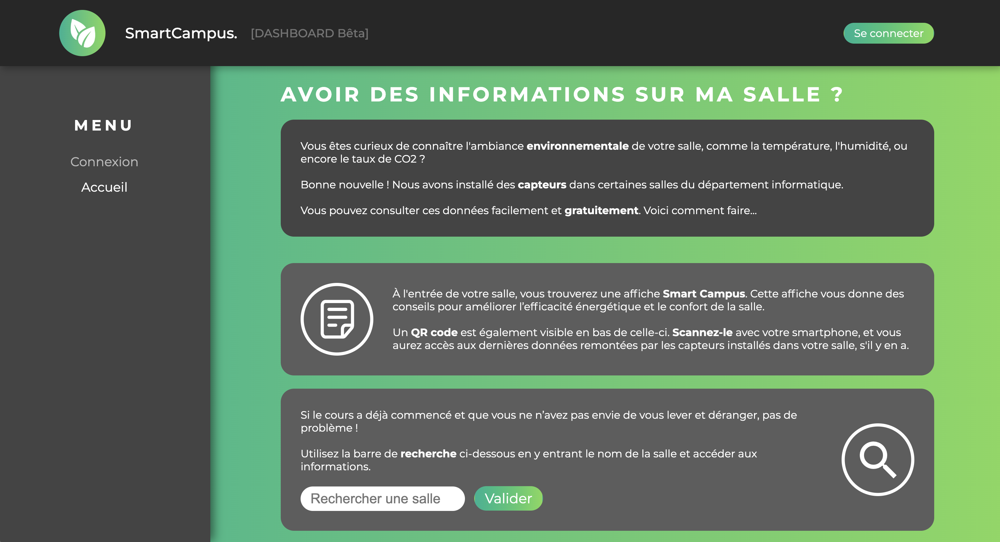
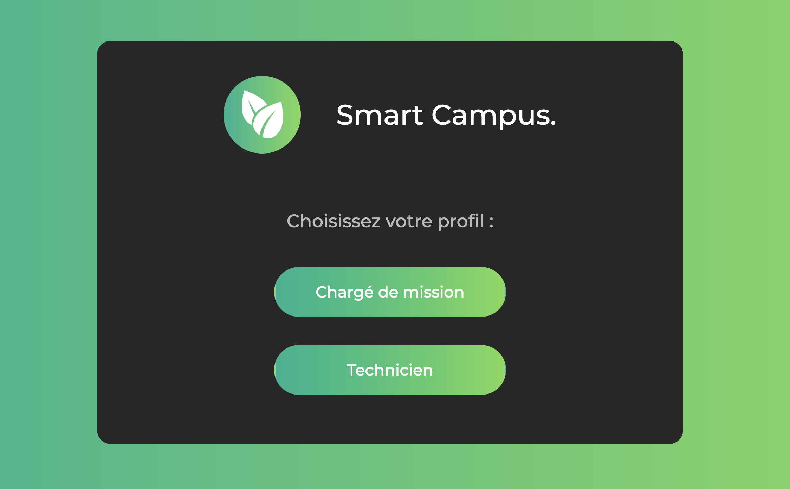
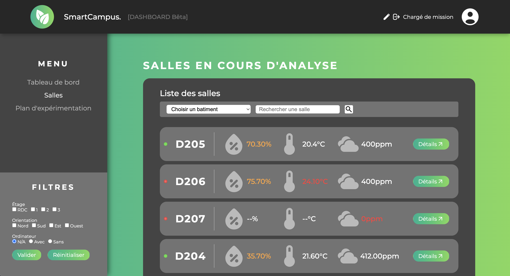
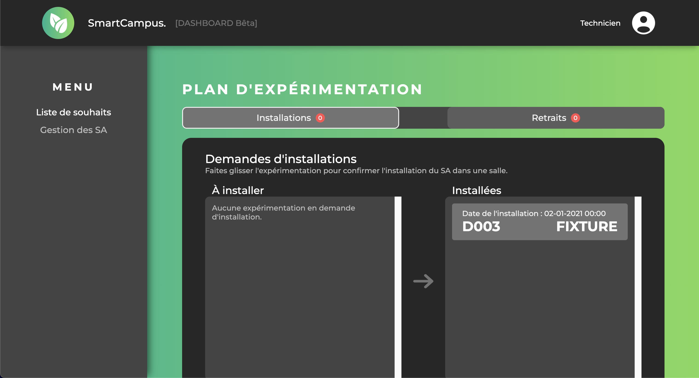
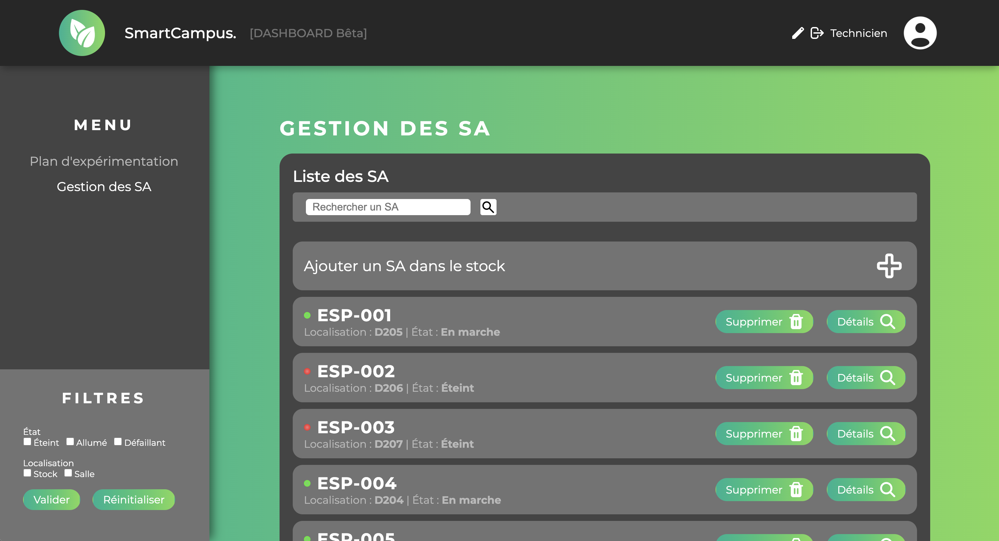

> ANCIEN Arthur - FREITAS DE SOUSA Rafael - BERGER Valentin - RENAUD Axel - DEMOUGE Colin <br>
> BUT2 - Groupe L22 <br>
> Projet SAE3.1 - Smart Campus. <br>

<div align="left">
  
</div>

## Présentation du projet - Smart Campus

Le projet Smart Campus a pour but d'améliorer la consommation et l'efficacité énergétique des bâtiments du campus universitaire de La Rochelle. Pour cela, nous mettons en place une application web reliée à des systèmes d'acquisition dans les salles afin de récupérer différentes données sur les salles de cours (dans un premier temps du bâtiment Informatique de l'IUT).

### Installation du projet en local

Pour installer le projet en local, il faut tout d'abord cloner le projet sur votre machine. Pour cela, il faut se rendre dans le dossier où vous souhaitez cloner le projet et exécuter la commande suivante :

```bash
git clone https://forge.iut-larochelle.fr/2023-2024-but-info2-a-sae34/l2/l22/sae3-l22.git
```

---

### Lancement du projet

Une fois le projet cloné, vous aurez besoin de docker afin de lancer la stack de développement avec la commande :
```bash
docker compose up --build
```

Il est possible que vous ayez besoin de mettre à jour les bundles de Symfony. Pour cela, il faut exécuter les commandes suivante :
```bash
docker exec -it  but-info2-a-sae3-sfapp bash  
cd sfapp
composer update
composer install
```

Pour mener à bien votre développement, vous pourrez également avoir besoin d'insérer des éléments dans la base de données, pour cela, il faudra exécuter les commandes suivantes (toujours dans le bash du conteneur `but-info2-a-sae3-sfapp`) :
```bash
php bin/console doctrine:migrations:migrate # Pour créer les tables dans la base de données si ce n'est pas déjà fait
php bin/console doctrine:fixtures:load --group=AppFixtures # Pour insérer le jeu de données dans la base de données
php bin/console doctrine:fixtures:load --group=AppFixturesTest # Pour load les fixtures dédié au tests
```
- Vous pouvez maintenant vous rendre sur l'adresse `localhost:8000` pour accéder à l'application web.

---

### Brève présentation des fonctionnalités

**Page de connexion**

En arrivant sur `localhost:8000`, vous arrivez sur la page d'accueil de l'application web. Vous y trouverez une rapide 
description du projet. Vous pouvez vous connecter sur le profil de votre choix en vous cliquant sur le bouton connexion.

<div align="center">
  
</div>

> Page d'accueil de l'application, l'usager peu y rechercher une salle pour accéder à ses données et des recommandations spécifiques.

<div align="center">
  
</div>

> Portail de connexion pour le chargé de mission et le technicien.

---

**Profil Chargé de Mission**

Le *Chargé de mission* à accès à trois pages différentes :
- Le tableau de bord sur lequel il peut voir une vision globale de ses expérimentations en cours et des salles de l'IUT.
- La page de gestion des expérimentations sur laquelle il peut ajouter et supprimer des salles au plan d'expérimentation.
- La page de gestion des salles sur laquelle il voit les salles en cours d'analyse et peut accéder aux données liées à ces salles.
    - Le CM a accès au détails de chaque salle en cours d'analyse, il y retrouvera les données instantanées, les pages d'historique/archive ainsi qu'une âge diagnostic pour les graphiques

<div align="center">
  
</div>

> La liste des salles du chargé de mission (lancez l'app pour en découvrir +)

---

**Profil Technicien**

Le *Technicien* à accès à deux pages différentes :
- Le plan d'expérimentation, sur lequel il peut voir les demandes d'installations ou de retrait d'un système d'acquisition dans une salle et les valider lorsque la demande est traitée.
- La page de gestion des SA sur laquelle il voit les SA de son stock et dans les salles et peut accéder aux données remontées si il y en a par le SA.

<div align="center">
  
</div>

> La liste des demandes d'installations ou retraits de SA par le CM 

<div align="center">
  
</div>

> Page de gestion des SA du technicien (lancez l'app pour en découvrir +).

---